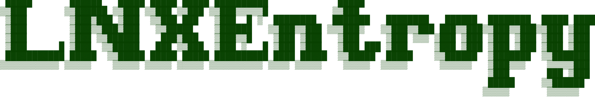

<div align="center">
    
</div>

<h2>STILL IN BUILD</h2>

## Description:
LNXEntropy is a library contain function that can add randomness to a pseudo-generated number

## Instruction:
1. Build the project using `make` 
```sh
make
```
2. Add `lnxentropy.so` during the compilation of your object files
```sh
gcc {your_compilation_flag} -L. -llnxentropy -c -o {yourfile}
```
- Remove every compilation object file
```sh
make clean
```
- Remove every compilation object file and remove the compiled file
```sh
make fclean
```
- Remove every compilation object file, remove the compiled file and rebuild the project
```sh
make re
```
